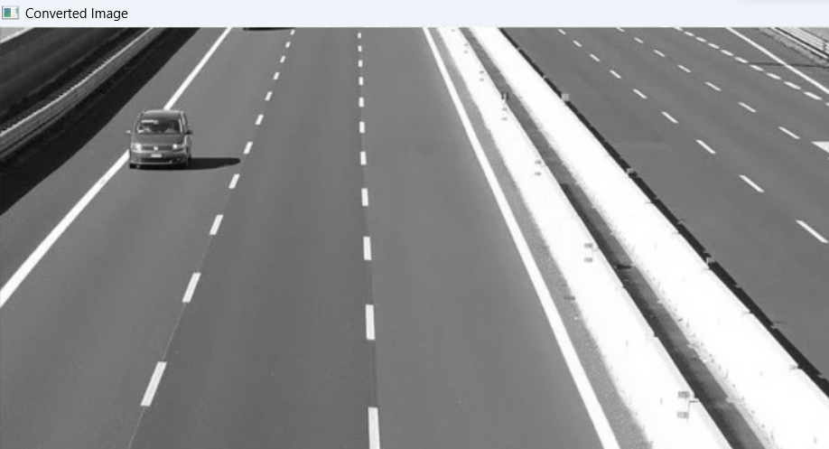
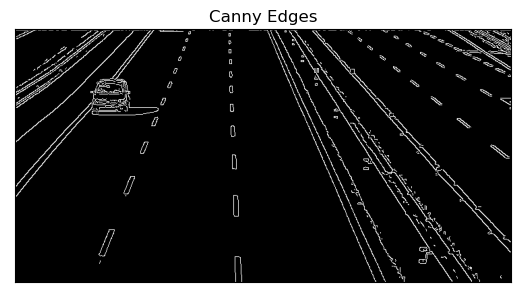
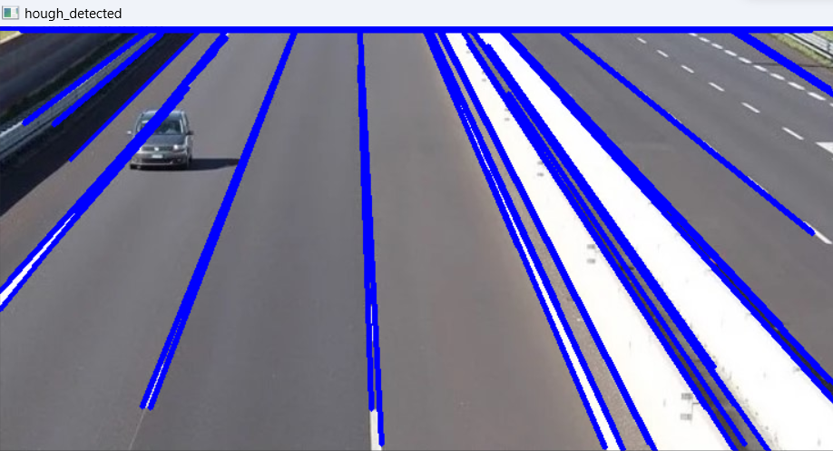

# Edge-Linking-using-Hough-Transform
## Aim:
To write a Python program to detect the lines using Hough Transform.

## Software Required:
Anaconda - Python 3.7

## Algorithm:
### Step1:
Read the image

### Step2:
Convert the input image to gray to get more details

### Step3:
Apply any smoothing filter , here we apply gaussian blur

### Step4:
Apply can edge detector

### Step5:
Apply hough transform and show the detected edge on the original image


## Program:
```
Developed By: Pranave B
Reg No      : 212221240040
```
```Python

# Read image and convert it to grayscale image

image = cv2.imread('lanes.jpg')
gimage = cv2.cvtColor(image, cv2.COLOR_BGR2GRAY)

cv2.imshow('Converted Image', gimage)
cv2.waitKey(0)
cv2.destroyAllWindows()

# Find the edges in the image using canny detector and display

canny_edge = cv2.Canny(image,120,150)
plt.imshow(canny_edge,cmap = 'gray')
plt.title('Canny Edges')
plt.xticks([])
plt.yticks([])
plt.show()


# Detect points that form a line using HoughLinesP

lines =cv2.HoughLinesP(canny_edge, 1, np.pi/180,threshold = 80, minLineLength =50 , maxLineGap = 250)

# Draw lines on the image

for line in lines:
    x1,y1,x2,y2 = line[0]
    cv2.line(image, (x1,y1),(x2,y2),(255,0,0),3)

# Display the result

cv2.imshow('hough_detected',image)
cv2.waitKey(0)
cv2.destroyAllWindows()


```
## Output

### Input image and grayscale image



### Canny Edge detector output



### Display the result of Hough transform



## Result:
Thus the program is written with python and OpenCV to detect lines using Hough transform. 
